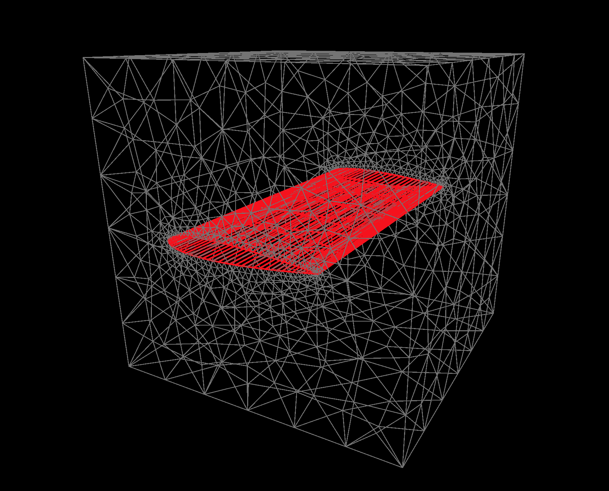

<h1 align="center">meshql</h1>
<p align="center">
    
</p>
<p align="center">query based meshing on top of GMSH</p>


# About
meshql is a declarative tool that parametrically generates meshes compliant with a variety of mesh formats with easy and configurable API on top of GMSH. This release is REALLY alpha. Use at your own risk.

# Tutorial
[https://www.youtube.com/watch?v=ltbxRsuvaLw](https://www.youtube.com/watch?v=ltbxRsuvaLw)

# Install
```
# Cadquery dependency install seperately since for some systems conda install is necessary
# Please view https://github.com/CadQuery/cadquery if install doesn't work for your system
conda install -c conda-forge -c cadquery cadquery=master


pip install git+https://github.com/OpenOrion/meshql.git#egg=meshql

```


# Example
See more examples in [examples](/examples) directory
## Cube
```python
import cadquery as cq
import numpy as np
from meshql import GeometryQL
from meshql.utils.shapes import generate_naca4_airfoil

# Create a simple CAD model
airfoil_coords = generate_naca4_airfoil("0012", num_points=40) * 5 - np.array([2.5,0])

with GeometryQL() as geo:
    geo = (
        geo
        .load(
            cq.Workplane("XY")
            .box(10,10,10)
            .faces(">Z")
            .workplane(centerOption="CenterOfMass")
            .polyline(airfoil_coords) # type: ignore
            .close()
            .cutThruAll()
        )

        .faces(type="interior")
        .addPhysicalGroup("wing")
        .addBoundaryLayer(
            size=0.001,
            ratio=1.5,
            num_layers=3,
        )
        .end()
        
        .generate(2)
        .show("mesh")

    )
```




# Developement Setup
```
git clone https://github.com/OpenOrion/meshql.git
cd meshql
pip install -r requirements_dev.txt
```

# Help Wanted
Please join the [Discord](https://discord.gg/H7qRauGkQ6) for project communications and collaboration. Please consider donating to the [Patreon](https://www.patreon.com/openorion) to support future work on this project.

