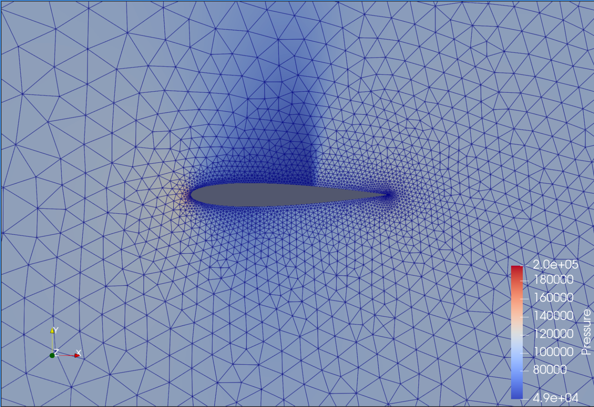
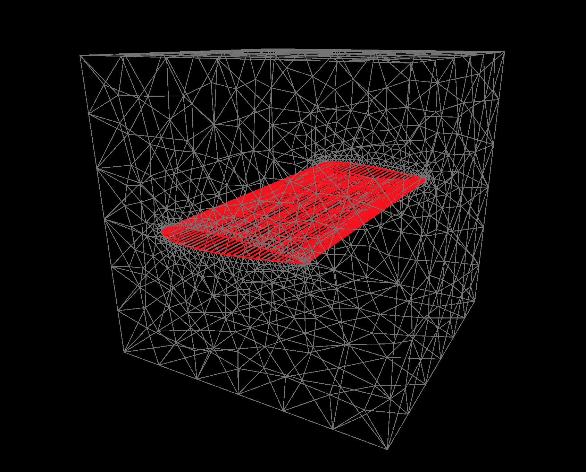

<h1 align="center">meshql</h1>
<p align="center">
    
</p>
<p align="center">Query-based meshing on top of GMSH</p>

[](https://github.com/OpenOrion/meshql)
[](LICENSE)
[](https://www.python.org/)

# About
meshql is a declarative, query-based tool for parametric mesh generation built on top of GMSH. It provides an intuitive API for creating structured and unstructured meshes with support for:

- **Query-based selection**: Use CadQuery-like selectors to target specific geometry entities
- **Boundary layers**: Automatic boundary layer generation for both 2D and 3D meshes
- **Transfinite meshing**: Automated structured meshing with intelligent edge/face grouping
- **Physical groups**: Easy boundary condition assignment with named groups
- **Preprocessing**: Advanced geometry splitting and partitioning for complex workflows
- **Multiple formats**: Export to GMSH, SU2, VTK, and other mesh formats
- **Visualization**: Built-in mesh and geometry visualization tools


# Installation

## Prerequisites
meshql requires GMSH and CadQuery. Install them first:

```bash
# Install GMSH (required)
conda install -c conda-forge gmsh python-gmsh

# Install CadQuery (required for CAD geometry support)
conda install -c conda-forge -c cadquery cadquery=master
```

## From PyPI
```bash
pip install meshql
```

## From Source
```bash
git clone https://github.com/OpenOrion/meshql.git
cd meshql
pip install -e ".[gmsh]"
```

# Quick Start

## Basic Example: NACA Airfoil with Boundary Layer
```python
import cadquery as cq
from meshql import GeometryQL
from meshql.utils.shapes import generate_naca4_airfoil

# Generate NACA 0012 airfoil coordinates
airfoil_coords = generate_naca4_airfoil("0012", num_points=40)

with GeometryQL.gmsh() as geo:
    mesh = (
        geo
        .load(
            cq.Workplane("XY")
            .circle(20)
            .polyline(airfoil_coords)
            .close()
        )
        
        # Configure airfoil surface
        .edges(type="interior")
        .addPhysicalGroup("airfoil")
        .addBoundaryLayer(
            ratio=2,
            size=0.00001,
            num_layers=40,
        )
        .setMeshSize(0.01)
        .end()

        # Configure farfield
        .edges(type="exterior")
        .addPhysicalGroup("farfield")
        .setMeshSize(3.0)
        .end()

        .generate(2)
        .show("mesh")
    )
```



## Structured Mesh with Preprocessing
```python
import cadquery as cq
from meshql import GeometryQL, Split

with GeometryQL.gmsh() as geo:
    (
        geo
        .load(
            cq.Workplane("XY").box(10, 10, 10).rect(2, 2).cutThruAll(),
            preprocess=(Split, lambda split: (
                split
                .from_plane(angle=(90, 90, 0))
                .from_plane(angle=(-90, 90, 0))
            )),
        )
        .setTransfiniteAuto(max_nodes=50)
        .generate(3)
        .show("mesh", only_surface=True)
    )
```

## 3D Wing with Interior Faces
```python
import cadquery as cq
import numpy as np
from meshql import GeometryQL
from meshql.utils.shapes import generate_naca4_airfoil

airfoil_coords = generate_naca4_airfoil("0012", num_points=40) * 5 - np.array([2.5, 0])

with GeometryQL.gmsh() as geo:
    (
        geo
        .load(
            cq.Workplane("XY")
            .box(10, 10, 10)
            .faces(">Z")
            .workplane(centerOption="CenterOfMass")
            .polyline(airfoil_coords)
            .close()
            .cutThruAll()
        )
        .faces(type="interior")
        .addPhysicalGroup("wing")
        .addBoundaryLayer(size=0.001, ratio=1.5, num_layers=3)
        .end()
        .generate(2)
        .show("mesh")
    )
```



# Key Features

## Selection System
Use intuitive CadQuery-style selectors to target geometry entities:

```python
.faces(">Z")           # Top faces
.edges(type="interior") # Interior edges
.solids()              # All solids
.vertices()            # All vertices
```

## Meshing Operations

### Boundary Layers
Automatic boundary layer generation for viscous flow simulations:

```python
.addBoundaryLayer(
    size=0.001,        # First cell height
    ratio=1.5,         # Growth ratio
    num_layers=10,     # Number of layers
)
```

### Transfinite Meshing
Automated structured meshing with intelligent parameter selection:

```python
.setTransfiniteAuto(
    max_nodes=50,           # Maximum nodes per edge
    min_nodes=2,            # Minimum nodes per edge
    auto_recombine=True,    # Recombine to quads/hexes
)
```

### Physical Groups
Assign boundary conditions with named groups:

```python
.faces(">Z")
.addPhysicalGroup("top_wall")
.end()

.faces("<Z")
.addPhysicalGroup("bottom_wall")
.end()
```

### Mesh Refinement
Control mesh size and algorithms:

```python
.setMeshSize(0.1)                     # Set mesh size
.setMeshAlgorithm2D("Delaunay")       # 2D algorithm
.setMeshAlgorithm3D("Delaunay")       # 3D algorithm
.refine()                             # Refine mesh
.recombine()                          # Recombine elements
```

## Preprocessing

### Geometry Splitting
Split complex geometries for structured meshing:

```python
preprocess=(Split, lambda split: (
    split
    .from_plane(angle=(90, 90, 0))           # Split by plane
    .from_ratios([0.25, 0.5, 0.75])          # Split by ratios
    .from_normals([(1, 0, 0), (0, 1, 0)])    # Split by normals
    .from_edge(selector=">Z")                 # Split from edge
))
```

### Mesh Import
Load existing meshes from various formats:

```python
import meshly

mesh = meshly.Mesh(
    vertices=vertices_array,
    indices=indices_array,
    markers={"boundary": [face_indices]}
)

geo.load(mesh)
```

## Output Formats
Export to multiple mesh formats:

```python
.write("output.msh", dim=2)   # GMSH format
.write("output.su2", dim=2)   # SU2 format
.write("output.vtk", dim=2)   # VTK format
```

## Visualization
Built-in visualization tools:

```python
.show("mesh")                       # Show mesh
.show("mesh", only_surface=True)    # Show surface only
.show("gmsh")                       # Open in GMSH GUI
```

# Examples

More examples available in the [examples](/examples) directory:

- **[cube.ipynb](/examples/cube.ipynb)**: Basic structured meshing with boundary layers
- **[naca0012.ipynb](/examples/naca0012.ipynb)**: Airfoil meshing with boundary layers
- **[inviscid_wedge.ipynb](/examples/inviscid_wedge.ipynb)**: Inviscid flow simulation setup
- **[turbo.ipynb](/examples/turbo.ipynb)**: Turbomachinery example with STEP import
- **[progression.ipynb](/examples/progression.ipynb)**: Mesh refinement progression

# Documentation
- **[Changelog](/CHANGELOG.md)**: Version history and feature releases

# Development Setup

## Quick Start
```bash
git clone https://github.com/OpenOrion/meshql.git
cd meshql
make install
```

## Available Make Commands
```bash
# Install package in development mode with GMSH support
make install

# Build Python package
make build-package

# Run tests
make test

# Clean build artifacts
make clean

# Quick local build (for testing)
make build
```

## Manual Installation
```bash
git clone https://github.com/OpenOrion/meshql.git
cd meshql
pip install -e ".[gmsh]"
```

# Contributing

We welcome contributions! Please check out the [Discord](https://discord.gg/H7qRauGkQ6) for discussions and collaboration.

## Support

- **Discord**: [Join our community](https://discord.gg/H7qRauGkQ6)
- **Issues**: [Report bugs or request features](https://github.com/OpenOrion/meshql/issues)

# Tutorial

Video tutorial available: [https://www.youtube.com/watch?v=ltbxRsuvaLw](https://www.youtube.com/watch?v=ltbxRsuvaLw)

# License

MIT License - see [LICENSE](LICENSE) file for details.